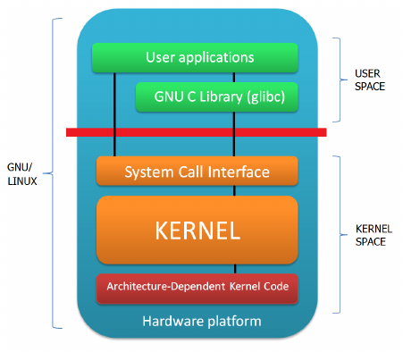

# Kernel

The kernel is the third element of embedded Linux.

The kernel has three main jobs:

1. To manage resources,

2. To interface with hardware, and

3. To provide an API that offers a useful level of abstraction to user space programs.

Applications running in **user space** run at a low CPU privilege level. They can do very little other than make library calls. The primary interface between the **user space** and the **kernel space** is the **C library**, which translates user-level functions, such as those defined by POSIX, into kernel system calls. 

The system call interface uses an architecture-specific
method, such as a trap or a software interrupt, to switch the CPU from low-privilege user mode to high-privilege kernel mode, which allows access to all memory addresses and
CPU registers.

The **system call handler** dispatches the call to the appropriate kernel subsystem: memory allocation calls go to the memory manager, filesystem calls to the filesystem code, and soon. Some of those calls require input from the underlying hardware and will be passed down to a device driver.

In other words, all the useful things that your application does, it does them through the kernel. The kernel, then, is one of the most important elements in the system.
