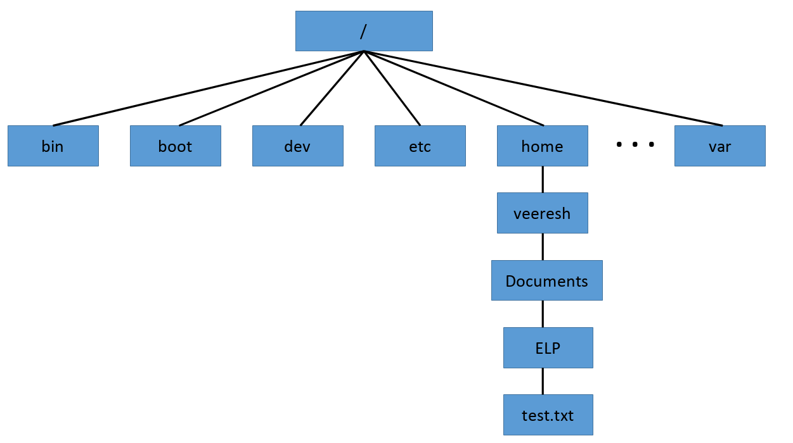

# Root filesystem

The root file system is the top of the hierarchical file tree. It contains the files and directories critical for system operation, including the device directory and programs for booting the system. The root file system also contains mount points where file systems can be mounted to connect to the root file system hierarchy.

Linux stores files within a single directory structure, called a virtual directory. The virtual directory contains file paths from all the storage devices installed on the computer, merged into a single directory structure.

The Linux virtual directory structure contains a single base directory, called the root(/). Directories and files beneath the root directory are listed based on the directory path used to get to them.

In Linux, you will see file paths similar to this:

/home/veeresh/Documents/ELP/test.txt

This indicates the file test.txt is in the directory Documents, under the directory veeresh, which is contained in the directory home. Notice that the path doesn’t provide any information as to which physical disk the file is stored on.

The Linux filesystem structure originally evolved from the Unix file structure. In a Linux filesystem, common directory names are used for common functions. Table below lists some of the more common Linux virtual top-level directory names and their contents.

| Directory | Usage                                                                                       |
|-----------|---------------------------------------------------------------------------------------------|
| /         | root of the virtual directory, where normally, no files are placed                          |
| /bin      | binary directory, where many GNU user-level utilities are stored                            |
| /boot     | boot directory, where boot files are stored                                                 |
| /dev      | device directory, where Linux creates device nodes                                          |
| /etc      | system configuration files directory                                                        |
| /home     | home directory, where Linux creates user directories                                        |
| /lib      | library directory, where system and application library files are stored                    |
| /media    | media directory, a common place for mount points used for removable media                   |
| /mnt      | mount directory, another common place for mount points used for removable media             |
| /opt      | optional directory, often used to store third-party software packages and data files        |
| /proc     | process directory, where current hardware and process information is stored                 |
| /root     | root home directory                                                                         |
| /sbin     | system binary directory, where many GNU admin-level utilities are stored                    |
| /run      | run directory, where runtime data is held during system operation                           |
| /srv      | service directory, where local services store their files                                   |
| /sys      | system directory, where system hardware information files are stored                        |
| /tmp      | temporary directory, where temporary work files can be created and destroyed                |
| /usr      | user binary directory, where the bulk of GNU user-level utilities and data files are stored |
| /var      | variable directory, for files that change frequently, such as log files                     |

The common Linux directory names are based upon the Filesystem Hierarchy Standard (FHS). For more information visit <https://refspecs.linuxfoundation.org/FHS_3.0/fhs/index.html>. Many Linux distributions maintain compliance with FHS. Therefore, you should be able to easily find files on any FHS-compliant Linux systems.
