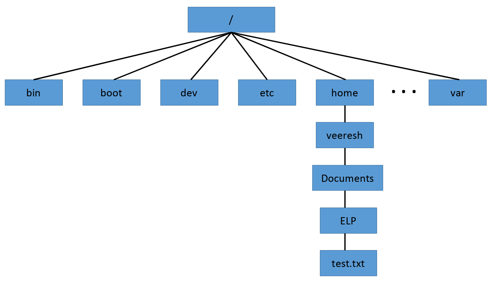

# Components of Embedded Linux

Here we will try to understand components of Embedded Linux:

1. Toolchain.
2. Bootloader.
3. Kernel.
4. Root filesystem.

There is also fifth component called applications, the collection of programs specific to your embedded application.

## Toolchain

The toolchain is the first element of embedded Linux and the starting point of your project. You will use it to compile all the code that will run on your device. The choices you make at this early stage will have a profound impact on the final outcome.

Your toolchain should remain constant throughout the project. In other words, once you have chosen your toolchain, it is important to stick with it. Changing compilers and development libraries in an inconsistent way during a project will lead to subtle bugs. That being said, it is still best to update your toolchain when security flaws or bugs are found.

A standard GNU toolchain consists of three main components:

**Binutils**: A set of binary utilities including the assembler and the linker. It is available at http://gnu.org/software/binutils.

**GNU Compiler Collection (GCC)**: These are the compilers for C and other languages, which, depending on the version of GCC, include C++, Objective-C, Objective-C++, Java, Fortran, Ada, and Go. They all use a common backend that
produces assembler code, which is fed to the GNU assembler. It is available at http://gcc.gnu.org/.

**C library**: A standardized application program interface (API) based on the POSIX specification, which is the main interface to the operating system kernel for applications.

### Types of toolchains

There are two types of toolchain:

**Native**: This toolchain runs on the same type of system (sometimes the same actual system) as the programs it generates. This is the usual case for desktops and servers, and it is becoming popular on certain classes of embedded devices. The BBB running Debian for ARM, for example, has self-hosted native compilers.

**Cross**: This toolchain runs on a different type of system than the target, allowing the development to be done on a fast desktop PC and then loaded onto the embedded target for testing.

As we would be using Yocto Project, it provides the toolchain needed for our development which is cross toolchain.

## Bootloader

Bootloader is the part that starts the system and loads the operating system kernel.

In an embedded Linux system, the bootloader has two main jobs:

1. To initialize the system to a basic level and to load the kernel.
2. Load the kernel

### The boot sequence

The boot sequence is a complex, multi-stage procedure as the modern SOCs have complex non-linear addressable storage.

1. Phase 1 – ROM code : The code that runs immediately after a reset or power-on has to be stored on-chip in the SoC; this is known as ROM code. It is loaded into the chip when it is manufactured, and hence the ROM code is proprietary and cannot be replaced by an open source equivalent.

2. Phase 2 - secondary program loader : The SPL must set up the memory controller and other essential parts of the system
in preparation for loading the Tertiary Program Loader (TPL) into DRAM.

3. Phase 3 – TPL : At this point, we are running a full bootloader, such as U-Boot.

### Moving from the bootloader to a kernel

When the bootloader passes control to the kernel, it has to pass some basic information, which includes the following:

1. The machine number, which is used on PowerPC and ARM platforms without support for a device tree, to identify the type of the SoC.

2. Basic details of the hardware that's been detected so far, including (at the very least) the size and location of the physical RAM and the CPU's clock speed.

3. The kernel command line.

4. Optionally, the location and size of a device tree binary.

5. Optionally, the location and size of an initial RAM disk, called the initial RAM file system (initramfs).

## Kernel

The kernel is the third element of embedded Linux.

The kernel has three main jobs:

1. To manage resources,

2. To interface with hardware, and

3. To provide an API that offers a useful level of abstraction to user space programs.

Applications running in **user space** run at a low CPU privilege level. They can do very little other than make library calls. The primary interface between the **user space** and the **kernel space** is the **C library**, which translates user-level functions, such as those defined
by POSIX, into kernel system calls. 

The system call interface uses an architecture-specific
method, such as a trap or a software interrupt, to switch the CPU from low-privilege user mode to high-privilege kernel mode, which allows access to all memory addresses and
CPU registers.

The **system call handler** dispatches the call to the appropriate kernel subsystem: memory allocation calls go to the memory manager, filesystem calls to the filesystem code, and soon. Some of those calls require input from the underlying hardware and will be passed down to a device driver.

In other words, all the useful things that your application does, it does them through the kernel. The kernel, then, is one of the most important elements in the system.

## Root filesystem

The root file system is the top of the hierarchical file tree. It contains the files and directories critical for system operation, including the device directory and programs for booting the system. The root file system also contains mount points where file systems can be mounted to connect to the root file system hierarchy.

Linux stores files within a single directory structure, called a virtual directory. The virtual directory contains file paths from all the storage devices installed on the computer, merged into a single directory structure.

The Linux virtual directory structure contains a single base directory, called the root(/). Directories and files beneath the root directory are listed based on the directory path used to get to them.

In Linux, you will see file paths similar to this:

/home/veeresh/Documents/ELP/test.txt

This indicates the file test.txt is in the directory Documents, under the directory veeresh, which is contained in the directory home. Notice that the path doesn’t provide any information as to which physical disk the file is stored on.

The Linux filesystem structure originally evolved from the Unix file structure. In a Linux filesystem, common directory names are used for common functions. Table below lists some of the more common Linux virtual top-level directory names and their contents.

| Directory | Usage                                                                                       |
|-----------|---------------------------------------------------------------------------------------------|
| /         | root of the virtual directory, where normally, no files are placed                          |
| /bin      | binary directory, where many GNU user-level utilities are stored                            |
| /boot     | boot directory, where boot files are stored                                                 |
| /dev      | device directory, where Linux creates device nodes                                          |
| /etc      | system configuration files directory                                                        |
| /home     | home directory, where Linux creates user directories                                        |
| /lib      | library directory, where system and application library files are stored                    |
| /media    | media directory, a common place for mount points used for removable media                   |
| /mnt      | mount directory, another common place for mount points used for removable media             |
| /opt      | optional directory, often used to store third-party software packages and data files        |
| /proc     | process directory, where current hardware and process information is stored                 |
| /root     | root home directory                                                                         |
| /sbin     | system binary directory, where many GNU admin-level utilities are stored                    |
| /run      | run directory, where runtime data is held during system operation                           |
| /srv      | service directory, where local services store their files                                   |
| /sys      | system directory, where system hardware information files are stored                        |
| /tmp      | temporary directory, where temporary work files can be created and destroyed                |
| /usr      | user binary directory, where the bulk of GNU user-level utilities and data files are stored |
| /var      | variable directory, for files that change frequently, such as log files                     |

The common Linux directory names are based upon the Filesystem Hierarchy Standard (FHS). For more information visit <https://refspecs.linuxfoundation.org/FHS_3.0/fhs/index.html>. Many Linux distributions maintain compliance with FHS. Therefore, you should be able to easily find files on any FHS-compliant Linux systems.

## Applications

Everything that runs in **User Space** is an Application.

Some of the Applications are:

1. Navigation
2. Sensor data capture
3. Controlling an actuator and many more.

For developing applications you need software development kit(SDK) as it is more convenient to use SKD for cross platform development.

Using Yocto project one can build all the components needed for an embedded Linux product.

1. Toolchain.
2. Bootloader.
3. Kernel.
4. Root filesystem.
5. Software development kit(SDK).
